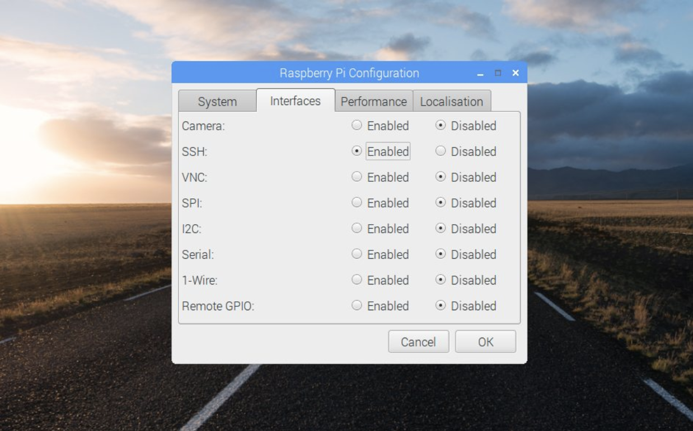
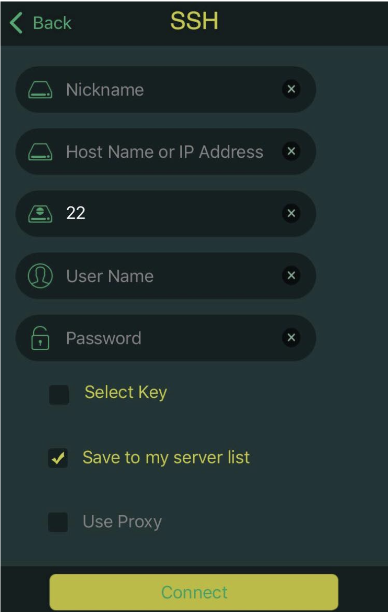

# Susi Linux

[](https://app.codacy.com/app/fossasia/susi_linux?utm_source=github.com&utm_medium=referral&utm_content=fossasia/susi_linux&utm_campaign=badger)
[](https://travis-ci.org/fossasia/susi_linux) 
[](https://gitter.im/fossasia/susi_hardware?utm_source=badge&utm_medium=badge&utm_campaign=pr-badge&utm_content=badge)
[](https://beta.gemnasium.com/projects/github.com/fossasia/susi_linux)

SUSI AI on Linux

This project aims at creating an implementation of Susi, capable to run on Linux Devices in a headless mode.
It will enable you to bring Susi AI intelligence to all devices you may think like a Speaker, Car etc.

**Current Status**
- Voice Detection working with Google Speech API/ IBM Watson Speech to Text API.
- Voice Output working with Google TTS/ IBM Watson TTS/ Flite TTS.
- Susi AI response working through Susi AI API Python Wrapper(https://github.com/fossasia/susi_api_wrapper)
- Hotword Detection works for hotword 'Susi'
- SUSI Wake Button in Raspberry Pi is working.
- Audio parsing working through SOX
- Youtube audio working MPV player
- Connection between the mobile devices and the smart speaker is done through ssh by using Access Point Mode

**Roadmap**
- Offline Voice Detection (if possible with satisfactory results)
- Make Update Daemon check for the updates at regular intervals

**General Working Of SUSI**
- SUSI.AI follows a finite state system for the code architecture.
- Multiple daemons are created during installation (Media Daemon, Factory Daemon, Update Daemon)
    - The Update Daemon updates the repo every time the Raspberry Pi is restarted up
    - The Media Daemon detects for USB connection and scans the songs present in it to play from Smart Speaker
    - The factory reset Daemon is a button on Port 17 which delete the repo completely and restores it from the backup
- A local Server is deployed every time the Rasperry Pi Starts and automatically switches to online server if there are any issues with the local server
- Google TTS and STT services are used as default services but if the internet fails, a switch to offline services PocketSphinx(STT) and Flite(TTS) is made automatically

## Setting up Susi on Linux

Setting up Susi on Linux is pretty easy.

**Note : For the app to work properly, repo must be cloned inside the folder `/home/pi/SUSI.AI/` , i.e. the path of your repo will look like `/home/pi/SUSI.AI/susi_linux/`**

### Minimum Requirements
* A hardware device capable to run Linux. It includes development boards like Raspberry Pi 
and other generic machines.
* A Debian based Linux Distribution. Tested on
    - Raspbian on Raspberry Pi 3
    - Ubuntu 64bit on x64 architecture
* A microphone for input. If you are using a development board like Raspberry Pi which does not have microphone
inbuilt, you can use a USB Microphone.
* A Speaker for Output. On development boards like Raspberry Pi, you can use a portable speaker that connects through
3.5mm audio jack.

### Installation on Raspberry Pi

For installation on Raspberry Pi, read [Raspberry Pi setup guide.](docs/raspberry-pi_install.md)

### Configuring a connection through SSH

Step 1: Initial Setup
* Both the raspberry Pi with raspbian installed and the mobile device should be on a same wireless network 
* One should have an SSH viewer like JuiceSSH(Android) and iTerminal(IOS) installed on their mobile devices
* Now we must enable SSH on our raspberry Pi

Step 2: Enabling SSH on Raspberry PI
* To enable SSH on your Pi , follow the following steps:
    <br>
    `Menu > Preferences > Raspberry Pi Configuration.`
    
    <br>
    Choose the interfaces tab and enable SSH
Step 3:Setting Up the client
* Login to your raspberry pi as the root user (pi by default)
* Type the following command to know the broadcasting ip address<br>
	`pi@raspberrypi:hostname -I`
* Now , open the client on your mobile device and add the configurations<br>

<p>By default the username of the system is ‘pi’ and the password is ‘raspberry’</p>

### Configuring SUSI.AI
* After Running the installation script , you'll have a RasPi in access point mode. With a Flask Server running at port 5000.
* You can use the mobile clients to configure the device automatically.<br>


* OR you can configure the Smart Speaker manually , in case of any failures in the mobile clients.

 - First, you have to configure the room name by hitting the url : localhost:5000/speaker_config?room_name=roomName 
    - Where roomName is the name of the room in which the speaker has too be placed
 - Second, to configure the wifi credentials, use the URL : localhost:5000/wifi_credentials?wifissid=WIFISSID&wifipassd=WIFIPASSD
    - Where WIFISSID is the name of your Wifi SSID and Wifi Password
 - Third, to configure your SUSI credentials use the URL :localhost:5000/auth?auth=y&email=EMAIL&password=PASSWORD.
    - Where EMAIL and PASSWORD are your login credentials of SUSI.AI
 - Finally use the URL : localhost:5000/config?stt=google&tts=google&hotword=y&wake=n

* Your RaspberryPi should restart automatically, if not execute the script `rwap.sh` in the access_point folder.

* To login in the speaker , start the configuration script by<br>
    `python3 config_generator.py <stt> <tts> <hotword_detection> <wake_button>`
    Where 
    - stt is the speech to text service
        - You have the following choices
        - 'google' if you want to use google as the stt service
        - 'ibm' if you want to use ibm as the stt service 
        - 'sphinx'(offline) if you want to use pocket-sphinx as the stt service 
    - tts is the text to speech service
        - Similarly,
        - You have the following choices
        -'google' if you want to use google as the tts service
        - 'ibm' if you want to use ibm as the tts service 
        - 'flite'(offline) if you want to use flite as the tts service
    - hotword_detection is the choice if you want to use snowboy detector as the hotword detection or not
        - 'y' to use snowboy
        - 'n' to use pocket sphinx
    - wake_button is the choice if you want to use an external wake button or not
        - 'y' to use an external wake button
        - 'n' to disable the external wake button
* Eg. To google as the default stt and tts and using snowboy as the default hotword detection engine and no wake button , you have to use the following command
````python3 config_generator.py google google y n ````

### Using SUSI in a Authenticated Mode 
<br>
* To use SUSI in an authenticated mode, you have to use the script 'authentication.py'<br>
    `python3 authentication.py <authentication_choice> <email> <password>`
    Where
    - authentication_choice is the choice if you want to use SUSI in an authenticated mode or not
    -  email is your registered email id with SUSI.AI
    -  password is your registered password of the corresponding email registered with SUSI.AI
* Eg. to use SUSI.AI in authenticated mode use 
`python3 authentication.py y example@example.com password`

### Installing on Ubuntu and other Debian based distributions 

For installation on Ubuntu and other Debian based distributions, read [Ubuntu Setup Guide](docs/ubuntu_install.md)

### Update Daemon

Use the following commands.
* `cd update_daemon/`
* `./update_check.sh`

### Factory Reset

To initiate the factory reset command.<br/>
Use the following commands.
* `cd factory_reset/`
* `chmod +x factory_reset.sh`
* `./factory_reset.sh`

## Setting Up the access point mode

To allow the raspberry Pi to behave as an access point
* Execute the wap.sh script by `./wap.sh`
* To convert RasPi back to normal mode use `./rwap.sh`

## SUSI Smart Speaker - IOS/Android Workflow


## To Use the ReSpeaker 2 Mic Array as a default Audio Driver
 * User can use `pacmd` to change the audio card to piHat
  - Use the following commands
     - `pacmd list-sinks` to check the index of the device
     -  `pacmd set-sink-port <sink name> <port name>` '<sink-name>' is generally 1 , but you can choose depending on your list.
     - eg. if you want to use inbuilt speaker ports ``pacmd set-sink-port alsa_output.platform-soc_sound.analog-stereo analog-output-speaker``
     - if you want to use your headphones with it , we use ``pacmd set-sink-port alsa_output.platform-soc_sound.analog-stereo analog-output-headphones``
     <br> <br>
<p>If the above approach doesn't work , you can use the following approach</p>

 * After running the installation script
  - Type this command `cd /etc/pulse`
  - Open the file `default.pa`
  - Replace line 38 by `load-module module-alsa-sink device=hw:2,1` (This will disable the default soundacards from loading up)
  - To enable default sound cards(usb mic,built-in headphone jack,etc ) , comment/delete out the above line

